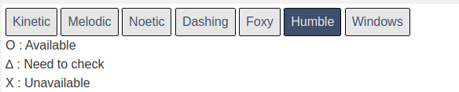

# 環境構築

環境構築が必要な物品は「TurtleBot3用ラズベリーパイ」「参加者用PC」の2点です。
基本的には、ROBOTIS社公式のe-manualに則ってセットアップを行いますが、
本ページでは参加者の皆様がスムーズにセミナーに参加できるように、セットアップ手順を補足します。

**TurtleBot3用ラズベリーパイ**

実習キットのTurtleBot3の上の段に格納されているラズベリーパイを使用します。
同包されているmicroSDカードを使用してセットアップを行います。

**参加者用PC**

Ubuntu22.04とROS 2 HumbleをインストールしたPCを用意いただきます。
最低限、1グループ1台のPCを用意いただければセミナーに参加いただけますが、参加者1人1台のPCを用意することを推奨します。

## 参加者用PCの環境構築

**基本はROBOTIS社TurtleBot3のe-manualの「3.1 PC Setup」にしたがってください。**  
https://emanual.robotis.com/docs/en/platform/turtlebot3/quick-start/

!!! warning
    e-manualを参照するときには、必ずページ上部の「Humble」ボタンを選択して参照するようにしてください。
    

### Ubuntu 22.04のインストール

詳細は[e-manual](https://emanual.robotis.com/docs/en/platform/turtlebot3/quick-start/)や[公式チュートリアル](https://ubuntu.com/tutorials/install-ubuntu-desktop#1-overview)を参照いただくことになりますが、大まかな手順は以下の通りです。

1. Ubuntu 22.04 Desktopのディスクイメージのダウンロード
2. USBメモリへディスクイメージへの書き込んでインストールメディアを作成する
3. インストールメディアからUbuntu 22.04 Desktopをインストールする

!!! info
    インストール用メディアを作るためのUSBメモリなどが必要になります

!!! note
    e-manualや公式チュートリアルでは英語版のUbuntu22.04のインストール手順が記載されていますが、以下のサイトから日本語版のダウンロードも可能です。  
    [Ubuntu Desktop 日本語 Remixのダウンロード](https://www.ubuntulinux.jp/download/ja-remix)

!!! note

    VirtualBoxやDockerなどの仮想環境を使用してもかまいませんが、正常動作しない場合への対応はできかねますので自己責任にてお願いします。

### ROS 2 Humble

[公式ガイド](https://docs.ros.org/en/humble/Installation/Ubuntu-Install-Debians.html)にしたがってROS 2 Humbleをインストールしてください。  

!!! note
    インストール作業だけでなく、同ページの[「Try some examples」](https://docs.ros.org/en/humble/Installation/Ubuntu-Install-Debians.html#try-some-examples)に書かれている簡単な動作確認も併せて行っていただくと、当日のトラブルのない進行につながります。

## TurtleBot3用ラズベリーパイの環境構築

**基本はROBOTIS社TurtleBot3のe-manualの「3.2 SBC Setup」にしたがってください。**  

[ROBOTIS公式 e-manual](https://emanual.robotis.com/docs/en/platform/turtlebot3/quick-start/)

!!! info
    ラズベリーパイの環境構築には以下のものが必要です。

    - microSD/SDカードに書き込み可能なPC（直接microSC/SDを扱えない場合はカードリーダーを使用する）
    - mini-HDMIケーブル（ラズベリーパイの画面出力用）
    - ディスプレイ（ラズベリーパイの画面出力用）
    - USBキーボード（ラズベリーパイの操作用）
    - USBマウス（ラズベリーパイの操作用）

!!! tips
    Ubuntu 22.04 **Desktop** ではなく Ubuntu 22.04 **Server** をインストールすることに注意してください。

<!-- ### 当日用PCとの直接接続

ラズベリーパイのセットアップに使用したWiFi環境は当日のセミナー会場で使用できない可能性が高いため、当日用PCと直接接続する方法を以下に示します。

**当日用PCでWiFiアクセスポイントを作成する**

1. WiFiの設定を開く（Windowsキーを押して出てくる検索画面で「wifi」と調べると出てくる）
2. WiFi設定画面の上にあるメニューを開き、「Turn On WiFi Spot...」をクリックする
3. WiFiアクセスポイントの名前とパスワードを設定し、アクセスポイントを有効化する

**ラズベリーパイを当日用PCと直接接続する**

1. WiFi設定用コマンドをインストールする `sudo apt install network-manager`
1. `sudo nano /etc/netplan/50-cloud-init.yaml`で設定を編集する
2. アクセスポイント欄に上で設定したアクセスポイントの名前とパスワードを設定する
 -->

!!! note
    e-manualでは、`ROS_DOMAIN_ID`を30に設定する記述がありますが、セミナー当日はグループ間での通信の混線を避けるため、オーガナイザーが指定する別々の`ROS_DOMAIN_ID`を設定してもらいます。
