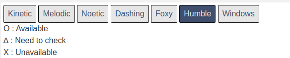

# 環境構築

環境構築が必要な物品は「TurtleBot3用ラズベリーパイ」「参加者用PC」の2点です。
基本的には、ROBOTIS社公式のe-manualに則ってセットアップを行いますが、
本ページでは参加者の皆様がスムーズにセミナーに参加できるように、セットアップ手順を補足します。

**TurtleBot3用ラズベリーパイ**

実習キットのTurtleBot3の上の段に格納されているラズベリーパイを使用します。
同包されているmicroSDカードを使用してセットアップを行います。

**参加者用PC**

最低限、1グループ1台のPCを用意いただければセミナーに参加いただけますが、参加者1人1台のPCを用意することを推奨します。

## 参加者用PCの環境構築

**基本はROBOTIS社TurtleBot3のe-manualの「3.1 PC Setup」にしたがってください。**  
https://emanual.robotis.com/docs/en/platform/turtlebot3/quick-start/

!!! warning
    e-manualを参照するときには、必ずページ上部の「Humble」ボタンを選択して参照するようにしてください。
    

### Ubuntu 22.04のインストール

詳細は[e-manual](https://emanual.robotis.com/docs/en/platform/turtlebot3/quick-start/)や[公式チュートリアル](https://ubuntu.com/tutorials/install-ubuntu-desktop#1-overview)を参照いただくことになりますが、大まかな手順は以下の通りです。

1. Ubuntu 22.04 Desktopのディスクイメージのダウンロード
2. USBメモリへディスクイメージへの書き込んでインストールメディアを作成する
3. インストールメディアからUbuntu 22.04 Desktopをインストールする

!!! info
    e-manualや公式チュートリアルでは英語版のUbuntu22.04のインストール手順が記載されていますが、以下のサイトから日本語版のダウンロードも可能です。  
    [Ubuntu Desktop 日本語 Remixのダウンロード](https://www.ubuntulinux.jp/download/ja-remix)

!!! note

    VirtualBoxやDockerなどの仮想環境を使用してもかまいませんが、正常動作しない場合への対応はできかねますので自己責任にてお願いします。

### ROS 2 Humble

[公式ガイド](https://docs.ros.org/en/humble/Installation/Ubuntu-Install-Debians.html)

## TurtleBot3用ラズベリーパイの環境構築

[ROBOTIS公式 e-manual](https://emanual.robotis.com/docs/en/platform/turtlebot3/quick-start/)